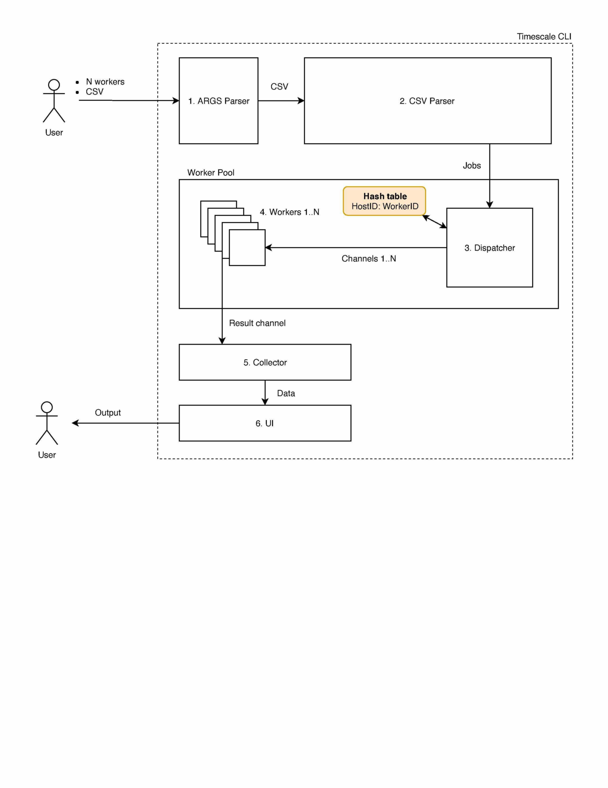

# Timescale CLI

A command line tool that can be used to benchmark SELECT query performance across multiple workers/clients against a TimescaleDB instance.

## Launch project

### Dockerized environment

You can build this project as a dockerized environment by simply executing `make docker-build`.

It will create two containers, a **timescaledb container** with sample data provided from *artifacts/cpu_usage.csv* file and **timescale-cli container** which mounts *artifacts* directory into *timescale-cli:/data*.

> NOTE: *project-path/artifacts* contains all files provided for this assignment

To run **timescale-cli** you can execute `make run` with provided ENV vars:

* CSV_FILE - path to CSV file
* WORKERS_NUM - number of running workers between <1-100> (default 1)

as example:

```sh
CSV_FILE=/data/query_params.csv WORKERS_NUM=10 make run
```

### Local environment

Run `make build` to build **timescale-cli** binary locally on your host.

> NOTE: It requires $GOBIN env to be set and make sure that it has been added to $PATH

Now you should be able to execeute `timescale-cli --help`

```
Usage of timescale-cli:
  -csv-file - path to CSV file
  -db-config - path to database config file (default "/etc/timescale-cli/db.yaml")
  -workers-num - number of running workers between <1-100> (default 1)
```

## Architecture overview

